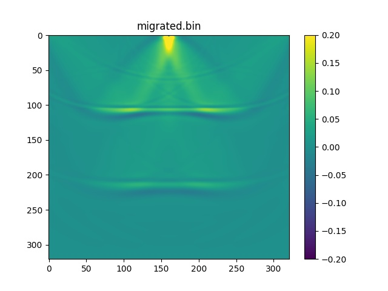

AWM2D (Acoustic Wave Modeling 2D)
=================================

This module provides functions for the 2D wave equation solving through the finite-difference method (FDM). It can also perform reverse time propagation of data for seismic migration.

AWM2D is written in Julia and advised by Átila Saraiva and Reynam Pestana through weekly meetings.

Examples
========

Three-layered geologic model (two interfaces)
---------------------------------------------

### P wave propagation snaps

### Reverse time P wave propagation snaps

### Reverse time migration (RTM)

Contact
=======

  - **Author:** Marcos Reinan de Assis Conceição
    - **E-mail:** [marcosrdac@gmail.com](mailto:marcosrdac@gmail.com)
    - **GitHub:** [marcosrdac](github.com/marcosrdac)
    - **Website:** [marcosrdac.com](www.marcosrdac.com)
  - **Advisor:** Átila Saraiva Quintela Soares
    - **E-mail:** [atilasaraiva@gmail.com](atilasaraiva@gmail.com)
  - **Advisor:** Reynam da Cruz Pestana
    - **E-mail:** [reynam@ufba.br](reynam@ufba.br)

Thanks
======

  - **Victor Kohene** - for tips and material on finite-difference method implementation.
